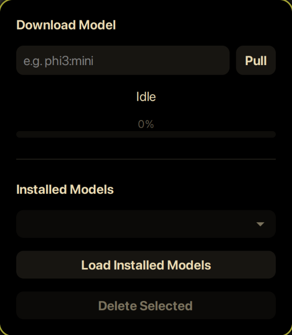

# Ollama Model Manager (GTK3)

A simple GTK3 frontend for managing your local Ollama models.



Pull models.  
Delete models.  
See progress.  
No terminal needed.

---

## ✨ Features

- View installed models
- Pull new models with live progress
- Delete models with confirmation
- Non-blocking UI (no freezing during downloads)

---

## 📦 Requirements

- Linux
- Python 3.9+
- GTK3
- Ollama running locally (`http://localhost:11434`)

---

## 🚀 Installation

### Recommended (Virtual Environment)

```bash
git clone https://github.com/sleeperofsaturn/ollama-model-manager.git
cd ollama-model-manager

python -m venv venv
source venv/bin/activate

pip install -r requirements.txt
python main.py
````

This keeps your system clean and works on any distro.

---

### Arch Linux (Alternative)

You can install dependencies system-wide:

```bash
sudo pacman -S python-requests
```

Then simply run:

```bash
python ollama-model-manager.py
```

---

## 🖥 Optional: Desktop Launcher

If you want it in your app launcher, create a `.desktop` file:

```ini
[Desktop Entry]
Name=Ollama Model Manager
Exec=python3 /absolute/path/to/ollama_model_manager.py
Icon=utilities-terminal
Type=Application
Categories=Utility;
Terminal=false
```

Place it in:

```
~/.local/share/applications/
```

---

## ⚙ Notes

* Make sure Ollama is running before launching.
* Uses the Ollama HTTP API under the hood; written in python.
* Tested on Arch Linux.

---

## 🪪 License
MIT
```
